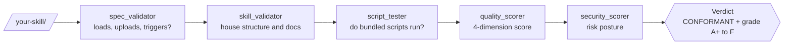

# Skill Pirate — Quality Assurance for Agent Skills

[](https://github.com/Gol-D-Al/skill-pirate/actions/workflows/ci.yml)
[](LICENSE)
[](https://www.python.org/downloads/)
[](#requirements)

**skill-pirate** boards your Agent Skills and inspects every plank before they sail: spec validation, script testing, and quality scoring before you ship.

## ⚓ Try it in 30 seconds

No install step, no dependencies — the repo is itself a valid skill, so it can inspect its own hull:

```bash
git clone https://github.com/Gol-D-Al/skill-pirate.git
cd skill-pirate
python3 scripts/spec_validator.py .
```

What that actually prints on a fresh clone (genuine output, lightly trimmed):

```text
=== skill-pirate  [tool] ===
  ! WARNING JUNK_FILES: Build or editor artifacts present: .git
              → These bloat the package and leak local state. Remove before publishing.
  · INFO    UNREACHABLE_FROM_SKILL_MD: assets/sample-skill/README.md is linked from another file but not reachable from SKILL.md.
  · INFO    DEEP_NESTING: assets/sample-skill/references/api-reference.md is nested 3 levels deep.
  · INFO    REFERENCE_NO_TOC: references/validator-comparison.md is 110 lines with no table of contents.
  CONFORMANT  (0 errors, 1 warnings, 4 notes)
```

Yes — it flags its own `.git` directory as packaging junk. A pirate who won't inspect his own ship can't be trusted with yours.

## Table of Contents

- [⚓ Try it in 30 seconds](#-try-it-in-30-seconds)
- [🧭 How it works](#-how-it-works)
- [Getting Started](#getting-started)
- [Why skill-pirate, and not another "skill-tester"?](#why-skill-pirate-and-not-another-skill-tester)
- [Overview](#overview)
- [Quick Start](#quick-start)
- [Components](#components)
- [🔍 Features](#-features)
- [CI/CD Integration](#cicd-integration)
- [Quality Standards](#quality-standards)
- [Self-Testing](#self-testing)
- [Advanced Usage](#advanced-usage)
- [Error Handling](#error-handling)
- [Output Formats](#output-formats)
- [Requirements](#requirements)
- [Contributing](#contributing)
- [License](#license)
- [🏴‍☠️ Join the crew](#-join-the-crew)

## 🧭 How it works

A skill passes through five independent inspections, each a standalone stdlib-only CLI. Run one, or run the whole gauntlet:



`scripts/spec_validator.py` rules on the letter of the Agent Skills spec (CONFORMANT or not); `scripts/skill_validator.py` and `scripts/quality_scorer.py` grade house-standard quality; `scripts/script_tester.py` exercises the bundled scripts; `scripts/security_scorer.py` scores risk posture. Where spec and house opinion disagree, **the spec wins**.

## Getting Started

No install step and no dependencies — clone and run (Python 3.9+):

```bash
git clone https://github.com/Gol-D-Al/skill-pirate.git
cd skill-pirate

# 1. Spec conformance — does the skill load, upload, and trigger?
python3 scripts/spec_validator.py path/to/your-skill

# 2. House-standard structure and documentation
python3 scripts/skill_validator.py path/to/your-skill

# 3. Multi-dimensional quality score with letter grade
python3 scripts/quality_scorer.py path/to/your-skill
```

No skill handy? Point it at itself — the repo is a valid skill and validates clean:

```bash
python3 scripts/spec_validator.py .
```

## Why skill-pirate, and not another "skill-tester"?

Several projects already occupy the obvious name — `Facets-cloud/claude-skill-tester`,
`skill-tester-swarm`, `openclaw-skill-tester`, and the `skill-tester` meta-skill inside
the big claude-skills monorepos (from which this project descends). The unique name is
deliberate. (Not to be confused with `pirate-skill`, Google Gemini's talk-like-a-pirate
demo — this is a QA tool.) The differences are substance, not branding:

- **Spec-first, opinions second.** `scripts/spec_validator.py` checks the rules of the
  actual [Agent Skills spec](references/agent-skills-spec.md) that decide whether a skill
  *loads, uploads, and triggers* (name charset and directory match, description limits,
  nested `SKILL.md`, dangling and escaping file references, orphaned bundled files, body
  line ceiling). `scripts/skill_validator.py` scores house-standard quality *separately* —
  and **where the two disagree, the spec wins**. No other skill-tester makes that
  distinction; most punish concise skills for not being padded.
- **Skill-type aware.** Skills are classified first (`documentation`, `tool`, `toolkit`,
  `router`) so script-oriented rules are never misapplied to skills that legitimately
  contain no scripts.
- **Adversarially tested.** `python3 -m pytest tests/ -q` runs 93 checks, including
  fixtures that construct deliberately broken skills and assert every defect is caught.
  A validator that is not itself tested is folklore.
- **Security posture scoring.** `scripts/security_scorer.py` is a dimension the
  alternatives don't have.
- **Zero dependencies.** Python stdlib only — runs on a clean Python 3.9+ install
  (CI-tested on 3.9 through 3.13).
- **Honest about the competition.** [references/validator-comparison.md](references/validator-comparison.md)
  documents how this tool compares to `skills-ref`, `agent-ecosystem/skill-validator`,
  and `agent-skills-lint` — *including where those tools are ahead*.

### At a glance

| Capability | skill-pirate | Typical "skill-tester" |
| --- | :---: | :---: |
| Spec conformance checking (loads, uploads, triggers) | ✅ | ❌ |
| House-quality scoring kept *separate* from spec rules | ✅ | ❌ |
| Adversarial self-tests (93 pytest checks on the validators themselves) | ✅ | ❌ |
| Security posture scoring | ✅ | ❌ |
| Zero dependencies (Python stdlib only) | ✅ | ❌ |
| Honest, documented comparison with competitors | ✅ | ❌ |

## Overview

Skill Pirate is a meta-skill that ensures quality and consistency across all skills in a repository through:

- **Structure Validation** - Verifies directory structure, file presence, and documentation standards
- **Script Testing** - Tests Python scripts for syntax, functionality, and compliance
- **Quality Scoring** - Provides comprehensive quality assessment across multiple dimensions

## Quick Start

### Validate a Skill
```bash
# Basic validation
python scripts/skill_validator.py engineering/my-skill

# Validate against specific tier
python scripts/skill_validator.py engineering/my-skill --tier POWERFUL --json
```

### Test Scripts
```bash
# Test all scripts in a skill
python scripts/script_tester.py engineering/my-skill

# Test with custom timeout
python scripts/script_tester.py engineering/my-skill --timeout 60 --json
```

### Score Quality
```bash
# Get quality assessment
python scripts/quality_scorer.py engineering/my-skill

# Detailed scoring with improvement suggestions
python scripts/quality_scorer.py engineering/my-skill --detailed --json
```

## Components

### Scripts
- **skill_validator.py** (700+ LOC) - Validates skill structure and compliance
- **script_tester.py** (800+ LOC) - Tests script functionality and quality
- **quality_scorer.py** (1100+ LOC) - Multi-dimensional quality assessment

### Reference Documentation
- **skill-structure-specification.md** - Complete structural requirements
- **tier-requirements-matrix.md** - Tier-specific quality standards
- **quality-scoring-rubric.md** - Detailed scoring methodology

### Sample Assets
- **sample-skill/** - Complete sample skill for testing the tester itself.
  Its skill file ships as `SKILL.md.fixture` rather than `SKILL.md`: a nested
  `SKILL.md` makes the whole package fail upload validation (a skill must contain
  exactly one, at its root). To use the fixture, restore the name first:

  The fixture's own docs are at [assets/sample-skill/README.md](assets/sample-skill/README.md)
  and [assets/sample-skill/references/api-reference.md](assets/sample-skill/references/api-reference.md).

  ```bash
  cp assets/sample-skill/SKILL.md.fixture assets/sample-skill/SKILL.md
  python3 scripts/skill_validator.py assets/sample-skill
  rm assets/sample-skill/SKILL.md   # restore packageable state
  ```

## 🔍 Features

<details>
<summary><b>Validation, testing, and scoring capabilities</b> — expand for the full inventory</summary>

### Validation Capabilities
- SKILL.md format and content validation
- Directory structure compliance checking
- Python script syntax and import validation
- Argparse implementation verification
- Tier-specific requirement enforcement

### Testing Framework
- Syntax validation using AST parsing
- Import analysis for external dependencies
- Runtime execution testing with timeout protection
- Help functionality verification
- Sample data processing validation
- Output format compliance checking

### Quality Assessment
- Documentation quality scoring (25%)
- Code quality evaluation (25%)
- Completeness assessment (25%)
- Usability analysis (25%)
- Letter grade assignment (A+ to F)
- Tier recommendation generation
- Improvement roadmap creation

</details>

## CI/CD Integration

<details>
<summary><b>GitHub Actions workflow and pre-commit hook</b> — copy-paste recipes</summary>

### GitHub Actions Example
```yaml
name: Skill Quality Gate
on:
  pull_request:
    paths: ['engineering/**']

jobs:
  validate-skills:
    runs-on: ubuntu-latest
    steps:
      - uses: actions/checkout@v7
      - name: Setup Python
        uses: actions/setup-python@v7
        with:
          python-version: '3.13'
      - name: Validate Skills
        run: |
          for skill in $(git diff --name-only ${{ github.event.before }} | grep -E '^engineering/[^/]+/' | cut -d'/' -f1-2 | sort -u); do
            python skill-pirate/scripts/skill_validator.py $skill --json
            python skill-pirate/scripts/script_tester.py $skill
            python skill-pirate/scripts/quality_scorer.py $skill --minimum-score 75
          done
```

### Pre-commit Hook
```bash
#!/bin/bash
# .git/hooks/pre-commit
python skill-pirate/scripts/skill_validator.py engineering/my-skill --tier STANDARD
if [ $? -ne 0 ]; then
    echo "Skill validation failed. Commit blocked."
    exit 1
fi
```

</details>

## Quality Standards

<details>
<summary><b>The standards every script in this repo is held to</b></summary>

### All Scripts
- **Zero External Dependencies** - Python standard library only
- **Comprehensive Error Handling** - Meaningful error messages and recovery
- **Dual Output Support** - Both JSON and human-readable formats
- **Proper Documentation** - Comprehensive docstrings and comments
- **CLI Best Practices** - Full argparse implementation with help text

### Validation Accuracy
- **Structure Checks** - 100% accurate directory and file validation
- **Content Analysis** - Deep parsing of SKILL.md and documentation
- **Code Analysis** - AST-based Python code validation
- **Compliance Scoring** - Objective, repeatable quality assessment

</details>

## Self-Testing

skill-pirate can validate itself:

```bash
# Validate the structure
python scripts/skill_validator.py . --tier POWERFUL

# Test the scripts
python scripts/script_tester.py .

# Score the quality
python scripts/quality_scorer.py . --detailed
```

## Advanced Usage

<details>
<summary><b>Batch validation, quality monitoring, and custom thresholds</b></summary>

### Batch Validation
```bash
# Validate all skills in repository
find engineering/ -maxdepth 1 -type d | while read skill; do
  echo "Validating $skill..."
  python skill-pirate/scripts/skill_validator.py "$skill"
done
```

### Quality Monitoring
```bash
# Generate quality report for all skills
python skill-pirate/scripts/quality_scorer.py engineering/ \
  --batch --json > quality_report.json
```

### Custom Scoring Thresholds
```bash
# Enforce minimum quality scores
python scripts/quality_scorer.py engineering/my-skill --minimum-score 80
# Exit code 0 = passed, 1 = failed, 2 = needs improvement
```

</details>

## Error Handling

<details>
<summary><b>How the scripts fail, and what they tell you when they do</b></summary>

All scripts provide comprehensive error handling:
- **File System Errors** - Missing files, permission issues, invalid paths
- **Content Errors** - Malformed YAML, invalid JSON, encoding issues
- **Execution Errors** - Script timeouts, runtime failures, import errors
- **Validation Errors** - Standards violations, compliance failures

</details>

## Output Formats

<details>
<summary><b>Human-readable report and JSON</b> — sample of each</summary>

### Human-Readable
```text
=== SKILL VALIDATION REPORT ===
Skill: engineering/my-skill
Overall Score: 85.2/100 (B+)
Tier Recommendation: STANDARD

STRUCTURE VALIDATION:
  ✓ PASS: SKILL.md found
  ✓ PASS: README.md found
  ✓ PASS: scripts/ directory found

SUGGESTIONS:
  • Add references/ directory
  • Improve error handling in main.py
```

### JSON Format
```json
{
  "skill_path": "engineering/my-skill",
  "overall_score": 85.2,
  "letter_grade": "B+",
  "tier_recommendation": "STANDARD",
  "dimensions": {
    "Documentation": {"score": 88.5, "weight": 0.25},
    "Code Quality": {"score": 82.0, "weight": 0.25},
    "Completeness": {"score": 85.5, "weight": 0.25},
    "Usability": {"score": 84.8, "weight": 0.25}
  }
}
```

</details>

## Requirements

- **Python 3.9+** - No external dependencies required (CI-tested on 3.9–3.13)
- **File System Access** - Read access to skill directories
- **Execution Permissions** - Ability to run Python scripts for testing

## Contributing

See [CONTRIBUTING.md](CONTRIBUTING.md) for how to run the tests, the two hard rules
(the repo must stay spec-CONFORMANT, and `scripts/` stays stdlib-only), and how to
propose changes. [SKILL.md](SKILL.md) holds the comprehensive skill documentation.

skill-pirate itself serves as a reference implementation of POWERFUL-tier quality standards.

## License

[MIT](LICENSE) — copyright (c) 2026 MrPirate.

## 🏴‍☠️ Join the crew

- **⭐ Star the repo** if skill-pirate kept a broken skill from shipping — it helps other skill authors find it.
- **Found a loose plank?** [Open an issue](https://github.com/Gol-D-Al/skill-pirate/issues). Worth knowing before you do: this repository is maintained by an autonomous local agent, and incoming issues are read and triaged by it. [TRAINING_LOG.md](TRAINING_LOG.md) is its machine-parseable log of every real maintenance event — what changed, why, how it was verified, and what failed along the way.
- **Want to send a pull request?** Start with [CONTRIBUTING.md](CONTRIBUTING.md); the ship's two hard rules are that the repo stays spec-CONFORMANT and `scripts/` stays stdlib-only.

*Fair winds, and may your skills always load on the first try.*
