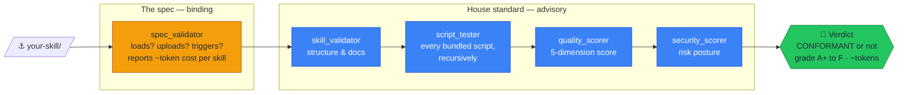

# Skill Vision — the QA skill for Claude skills

[](https://github.com/AlveeeRahman/skill-vision/actions/workflows/ci.yml)
[](LICENSE)
[](https://www.python.org/downloads/)
[](#%EF%B8%8F-under-the-hood-the-five-validators)

**skill-vision** is an [Agent Skill](https://code.claude.com/docs/en/skills) for Claude Code that inspects your *other* skills before they ship. Install it, then just ask Claude *"validate my skill"* and Claude boards your skill, runs the right inspections, and explains what would keep it from loading, uploading, or triggering.

## ⚓ Get it aboard

```bash
# All your projects (personal skill):
git clone https://github.com/AlveeeRahman/skill-vision.git ~/.claude/skills/skill-vision

# Or one project only (project skill — ships to your team through git):
git clone https://github.com/AlveeeRahman/skill-vision.git .claude/skills/skill-vision
```

That's the whole install — no packages, no venv (any Python 3.9+). Then ask Claude, in your own words:

> *"Validate `./my-skill` against the Agent Skills spec."*
> *"Score the quality of my skill and tell me what to fix first."*
> *"Is this skill ready to upload to claude.ai?"*

Claude reads this skill's instructions, picks the right validator, runs it, and works the improvement roadmap with you.

## See what Claude runs for you

The repo is itself a valid skill, so it inspects its own hull. Genuine output on a fresh clone:

```text
=== skill-vision  [tool] · ~2.0k tokens (description 115 every session + body 1.9k on trigger) ===
  · INFO    DEEP_NESTING: assets/sample-skill/references/api-reference.md is nested 3 levels deep.
              → Keep reference files shallow so they are easy to discover.
  · INFO    GIT_DIR: A .git directory is present (normal for a cloned skill).
              → Exclude it when zipping for upload: zip -r skill.zip . -x '.git/*' '.git'
  CONFORMANT  (0 errors, 0 warnings, 2 notes)
```

The header states what the skill costs you in context — description tokens load every session, body tokens on trigger — and it even notices its own `.git` directory and tells you how to keep it out of your upload. A checker that never looks at itself can't be trusted to look at yours.

## How it works

Your skill passes through five independent inspections:



The amber gate is binding: `scripts/spec_validator.py` rules on the letter of the Agent Skills spec — the rules that decide whether a skill actually loads, uploads, and triggers — and reports each skill's estimated context cost (description tokens load every session; body tokens load on trigger, the way Claude Code's own doctor counts them). The blue chain is advisory: structure and docs, script execution (recursive — nested `scripts/` packages included), a five-dimension score with letter grade, and security posture. Where spec and house opinion disagree, **the spec wins** — skill-vision never asks you to pad a concise skill to satisfy someone's style guide.

## Why skill-vision, and not another "skill-tester"?

Several projects already occupy that name — `Facets-cloud/claude-skill-tester`,
`skill-tester-swarm`, `openclaw-skill-tester`, and the `skill-tester` meta-skill inside
the big claude-skills monorepos (from which this project descends). This one is named
for what it does: it examines your skills and tells you exactly what would keep them
from loading, uploading, or triggering. The differences are substance, not branding:

- **Spec-first, opinions second.** Spec conformance ([the rules](references/agent-skills-spec.md)
  that break a skill) and house-standard quality (opinions) are separate verdicts from
  separate tools — and the spec wins. Most alternatives blend them and punish concise
  skills for not being padded.
- **Skill-type aware.** Skills are classified first (`documentation`, `tool`, `toolkit`,
  `router`) so script-oriented rules are never misapplied to skills that legitimately
  contain no scripts.
- **Adversarially tested.** `python3 -m pytest tests/ -q` runs 117 checks, including
  fixtures that construct deliberately broken skills and assert every defect is caught.
  A validator that is not itself tested is folklore.
- **Security posture scoring.** `scripts/security_scorer.py` is a dimension the
  alternatives don't have.
- **Honest about the competition.** [references/validator-comparison.md](references/validator-comparison.md)
  documents how this tool compares to `skills-ref`, `agent-ecosystem/skill-validator`,
  and `agent-skills-lint` — *including where those tools are ahead*.

## Field results: a 10-skill audit

All five validators were run over a private corpus of 10 real, in-use skills (75 Python
scripts, ~20k scripts). Skills are anonymized: the ten best are labeled `Sk1`–`Sk10`
below, ordered by quality score.

### Top 10 by quality score

| Skill | Type | Spec | Structure | Quality | Security | ~Tokens |
|---|---|:---:|--:|--:|--:|--:|
| Sk1 | router | pass | 92.2 | 66.2 | 81.7 | 2.7k |
| Sk2 | tool | pass | 80.6 | 65.0 | 87.0 | 1.0k |
| Sk3 | router | pass | 71.5 | 63.3 | 79.7 | 2.0k |
| Sk4 | tool | pass | 88.2 | 62.2 | 86.0 | 3.3k |
| Sk5 | tool | pass | 84.6 | 62.2 | 86.0 | 3.3k |
| Sk6 | tool | pass | 84.1 | 60.9 | 80.7 | 1.1k |
| Sk7 | router | pass | 82.4 | 60.6 | 80.9 | 2.8k |
| Sk8 | router | pass | 67.9 | 57.3 | 78.0 | 2.2k |
| Sk9 | tool | pass | 58.8 | 56.0 | 80.5 | 2.2k |
| Sk10 | tool | fail | 70.2 | 55.9 | 80.6 | 8.3k |

What the audit says about skills in the wild:
- **Context cost varies 7×** across the corpus (~0.5k to ~4.3k tokens per skill), which is
  why skill-vision now prints each skill's token cost in its report header.
- **Most script "failures" are conventions, not broken code** — bundled library modules and
  copy-adapt training templates being held to CLI standards. Syntax validity was 100%.

## Beyond Claude Code: claude.ai, Desktop, API

**claude.ai / Claude Desktop** — skills upload as a ZIP containing one top-level folder with `SKILL.md` inside it:

```bash
# From the directory that contains skill-vision/ — note the .git exclusion:
zip -r skill-vision.zip skill-vision -x "skill-vision/.git/*" "skill-vision/.git"
```

Upload at **Settings → Features → Skills** (claude.ai) or **"+" → Create skill** (Desktop). One caveat: the web uploader caps the frontmatter `description` at **200 characters** (the spec allows 1024, and this repo ships 460, tuned for Claude Code triggering). Shorten it in your zip copy — e.g. *"Validate, test, and score Agent Skills before you ship: spec conformance, structure checks, script testing, quality grades A–F, and security posture."*

Skills enabled on claude.ai can also come back to the CLI — a one-time

```bash
CLAUDE_CODE_SYNC_SKILLS=1 claude -p "load skills"
```

downloads them into `~/.claude/skills/synced/`, where every future local Claude Code session loads them automatically (re-run it after updating a skill on claude.ai).

**Claude API** — upload the same ZIP via the beta skills endpoints (`client.beta.skills.create`) and attach it with `container: {skills: [{type: "custom", skill_id: ...}]}`. The API execution container has no network and no package installs — skill-vision is stdlib-only precisely so it runs there unmodified.

**A spec rule this repo demonstrates:** a package may contain exactly one `SKILL.md`, at its root. That's why the bundled demo skill ships its manifest as `assets/sample-skill/SKILL.md.fixture` — restore the name only while practicing on it:

```bash
cp assets/sample-skill/SKILL.md.fixture assets/sample-skill/SKILL.md
python3 scripts/skill_validator.py assets/sample-skill
rm assets/sample-skill/SKILL.md
```

## 🛠️ Under the hood: the five validators

Everything Claude runs for you is a plain stdlib CLI — which means your CI can run the same inspections without Claude in the loop:

```bash
python3 scripts/spec_validator.py path/to/your-skill            # spec: will it load? (--strict, --recursive)
python3 scripts/skill_validator.py path/to/your-skill --json    # house structure (--tier BASIC|STANDARD|POWERFUL)
python3 scripts/script_tester.py path/to/your-skill             # do bundled scripts run? (--timeout, default 30s)
python3 scripts/quality_scorer.py path/to/your-skill --detailed # score + grade + improvement roadmap
python3 scripts/security_scorer.py path/to/your-skill           # risk posture
```

<details>
<summary><b>Exit codes</b> — verified behavior, safe to build CI gates on</summary>

| Code | spec_validator | skill_validator | quality_scorer | script_tester |
| :---: | --- | --- | --- | --- |
| 0 | conformant | passed (score ≥ 60, no errors) | grade C- or better, above `--minimum-score` | all scripts pass |
| 1 | violations (or warnings with `--strict`) | errors or score < 60 | grade F, or below `--minimum-score` | failures |
| 2 | — | — | grade D (needs improvement) | partial success |
| 130 | — | interrupted (Ctrl-C) | interrupted | interrupted |

Failures are reported inside the report itself (missing paths, malformed YAML frontmatter, unreadable files), and every tool supports `--json` for machine consumption. Script execution is timeout-protected, so a hanging script under test cannot hang the validator.

</details>

<details>
<summary><b>CI and pre-commit recipes</b> — gate a whole repo of skills</summary>

This repo gates itself this way — the live workflow is [.github/workflows/ci.yml](.github/workflows/ci.yml).

```yaml
# GitHub Actions — assumes your skills live in skills/<name>/
name: Skill Quality Gate
on:
  pull_request:

jobs:
  validate-skills:
    runs-on: ubuntu-latest
    steps:
      - uses: actions/checkout@v7
      - uses: actions/setup-python@v7
        with:
          python-version: '3.13'
      - name: Get skill-vision
        run: git clone --depth 1 https://github.com/AlveeeRahman/skill-vision.git /tmp/skill-vision
      - name: Validate all skills
        run: |
          python /tmp/skill-vision/scripts/spec_validator.py skills --recursive
          for skill in skills/*/; do
            python /tmp/skill-vision/scripts/quality_scorer.py "$skill" --minimum-score 75
          done
```

```bash
#!/bin/bash
# .git/hooks/pre-commit — block commits that break the skill
python3 ~/.claude/skills/skill-vision/scripts/spec_validator.py path/to/your-skill || {
    echo "Skill violates the Agent Skills spec. Commit blocked."
    exit 1
}
```

</details>

## What's in the box

- **`SKILL.md`** — the instructions Claude loads: when to inspect, which tool to run, how to work the roadmap.
- **`scripts/`** — the five validators (all stdlib-only): `spec_validator.py`, `skill_validator.py`, `script_tester.py`, `quality_scorer.py`, `security_scorer.py`.
- **`references/`** — the standards the tools implement: [agent-skills-spec.md](references/agent-skills-spec.md), [skill-structure-specification.md](references/skill-structure-specification.md), [tier-requirements-matrix.md](references/tier-requirements-matrix.md), [quality-scoring-rubric.md](references/quality-scoring-rubric.md), [validator-comparison.md](references/validator-comparison.md).
- **`assets/sample-skill/`** — a demo skill to practice on. Its own docs: [assets/sample-skill/README.md](assets/sample-skill/README.md) and [assets/sample-skill/references/api-reference.md](assets/sample-skill/references/api-reference.md).
- **`tests/`** — 117 adversarial checks on the validators themselves.

## 👀 Who checks the checker? — a challenge

Want a fun one? Improve skill-vision — then make the *current* checker examine the *new*
one before it takes over:

```bash
# 1. Keep the incumbent around
git clone https://github.com/AlveeeRahman/skill-vision.git /tmp/incumbent

# 2. Make your improvements in your working copy,
#    then let the incumbent judge the candidate…
python3 /tmp/incumbent/scripts/spec_validator.py .             # does the new checker still load?
python3 /tmp/incumbent/scripts/quality_scorer.py . --detailed  # did the grade go up, or down?

# 3. …and reverse the lens: the candidate examines the incumbent
python3 scripts/quality_scorer.py /tmp/incumbent --detailed
```

House rule for pull requests: **the candidate must score at least as well under the
incumbent as the incumbent scores under the candidate** — nobody gets to lower the bar
for their own inspection. And if your new checker spots a *real* bug in the old one, that
is the highest honor this repo awards: document it, and it joins the defect table above.

**Brag with numbers.** Ran skill-vision on your own best skill? Post its report header — the
token line, the `CONFORMANT` verdict, and your quality score — in an
[issue labeled `checkup`](https://github.com/AlveeeRahman/skill-vision/issues/new?labels=checkup&title=Checkup%3A+my-skill).
The highest verified score earns a permanent shout-out in this README.

## Contributing

See [CONTRIBUTING.md](CONTRIBUTING.md): how to run the tests, and the ship's two hard rules — the repo stays spec-CONFORMANT, and `scripts/` stays stdlib-only. [SKILL.md](SKILL.md) holds the full skill documentation.

## License

[MIT License](https://github.com/AlveeeRahman/skill-vision/blob/main/LICENSE) — copyright (c) 2026 MrPirate. Full text in [`LICENSE`](LICENSE) at the repo root.

## 🏴‍☠️ Join the crew

- **⭐ Star the repo** if skill-vision kept a broken skill from shipping — it helps other skill authors find it.
- **Found a loose plank?** [Open an issue](https://github.com/AlveeeRahman/skill-vision/issues). This repository is maintained with the help of an autonomous local agent that reads and triages what comes in.

*Fair winds, and may your skills always load on the first try.*
