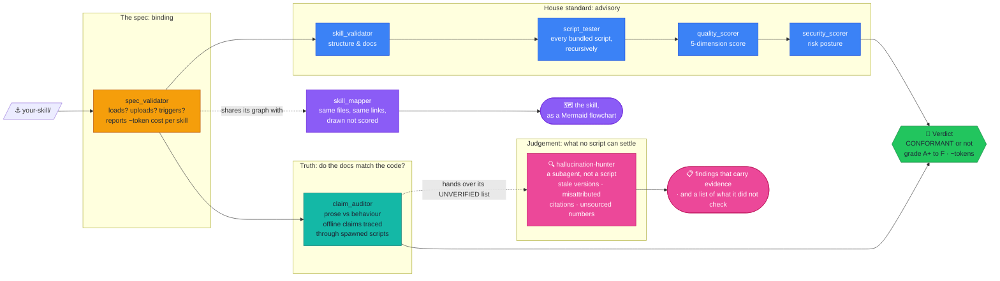
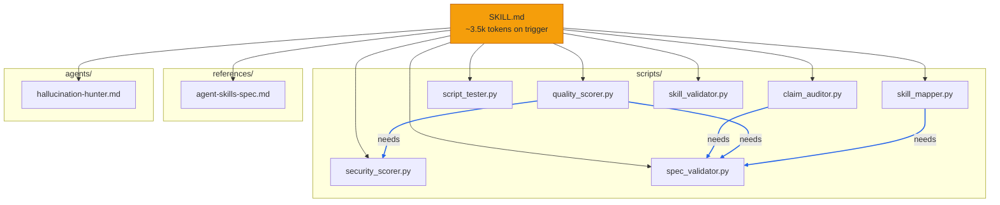

# Skill Vision: a Claude Agent Skill validator

[](https://github.com/AlveeeRahman/skill-vision/actions/workflows/ci.yml)
[](LICENSE)
[](https://www.python.org/downloads/)
[](#%EF%B8%8F-under-the-hood-the-five-validators)

**Documentation**: [alveeerahman.github.io/skill-vision](https://alveeerahman.github.io/skill-vision/) ·
part of a three-skill suite with [Agent Oracle](https://alveeerahman.github.io/agent-oracle/)
and [Research Hound](https://alveeerahman.github.io/research-hound/).

**skill-vision** is a Claude Agent Skill validator — an [Agent Skill](https://code.claude.com/docs/en/skills) for Claude Code that inspects your *other* skills before they ship. Install it, then just ask Claude *"validate my skill"* and Claude boards your skill, runs the right inspections, and explains what would keep it from loading, uploading, or triggering.

## What's in it

| Feature | What it answers | Runs as |
| --- | --- | --- |
| **Spec conformance** | Will this skill load, upload and trigger, by the letter of the Agent Skills spec? | `scripts/spec_validator.py` |
| **Token cost** | What does this skill cost in context — description tokens every session, body tokens on trigger? | `scripts/spec_validator.py` |
| **Structure & docs** | Is the layout sound and the documentation complete? | `scripts/skill_validator.py` |
| **Script execution** | Do the bundled scripts actually run, including nested packages? | `scripts/script_tester.py` |
| **Quality score** | Five dimensions, an A+ to F grade, and an ordered roadmap of what to fix first. | `scripts/quality_scorer.py` |
| **Security posture** | Credentials, injection, path traversal — with detectors hardened against false positives. | `scripts/security_scorer.py` |
| **Documentation truth** | Do the docs match the code? Traces "runs offline" claims *through* spawned scripts. | `scripts/claim_auditor.py` |
| **Codebase map** | What is actually in the skill, and what can Claude reach from SKILL.md? Draws it as Mermaid. | `scripts/skill_mapper.py` |
| **Hallucination hunting** | Stale versions, misattributed citations, unsourced numbers, instructions that cannot be followed — the judgement half no script can settle. | [`agents/hallucination-hunter.md`](agents/hallucination-hunter.md) — a subagent |

Everything above is stdlib-only Python 3.9+, with `--json` on every tool and CI-friendly
exit codes, so a pipeline can run the same inspections with no model in the loop. No
bundled script opens a network connection. The validators are covered by 196 adversarial
tests, including a parity suite proving the map and the spec verdict cannot drift apart,
and false-positive fixtures asserting that a correct skill produces no findings.

## ⚓ Get it aboard

```bash
# All your projects (personal skill):
git clone https://github.com/AlveeeRahman/skill-vision.git ~/.claude/skills/skill-vision

# Or one project only (project skill, ships to your team through git):
git clone https://github.com/AlveeeRahman/skill-vision.git .claude/skills/skill-vision
```

That's the whole install. No packages, no venv, just any Python 3.9+. Then ask Claude, in your own words:

> *"Validate `./my-skill` against the Agent Skills spec."*
> *"Score the quality of my skill and tell me what to fix first."*
> *"Is this skill ready to upload to claude.ai?"*

Claude reads this skill's instructions, picks the right validator, runs it, and works the improvement roadmap with you.

## See what Claude runs for you

The repo is itself a valid skill, so it inspects its own hull. Genuine output on a fresh clone:

```text
=== skill-vision  [tool] · ~3.6k tokens (description 115 every session + body 3.4k on trigger) ===
  · INFO    BODY_TOKEN_ABOVE_TARGET: SKILL.md body is ~3446 tokens (practical target ~2500).
  · INFO    DEEP_NESTING: assets/sample-skill/references/api-reference.md sits 3 directories deep on disk.
              → Keep reference files shallow so they are easy to discover by hand.
  · INFO    GIT_DIR: A .git directory is present (normal for a cloned skill).
              → Exclude it when zipping for upload: zip -r skill.zip . -x '.git/*' '.git'
  CONFORMANT  (0 errors, 0 warnings, 3 notes)
```

The header states what the skill costs you in context: description tokens load every session, body tokens on trigger. It even notices its own `.git` directory and tells you how to keep it out of your upload. A checker that never looks at itself can't be trusted to look at yours, and it does not spare itself. That first note is this skill's own body running over its own recommended budget, left visible rather than quietly excluded.

And it checks whether its own docs are telling the truth:

```text
=== claim audit: skill-vision ===
  checked: 26 documented commands, 11 reach claims, 0 count claims, 26 path mentions,
           0 capability claims, 8 scripts analysed
  TRUTHFUL  (0 contradictions)
```

## How it works

Your skill passes through six independent inspections, one that draws a picture instead of a verdict, and a subagent for the questions no script can settle:



The amber gate is binding. `scripts/spec_validator.py` rules on the letter of the Agent Skills spec, the rules that decide whether a skill actually loads, uploads, and triggers. It also reports each skill's estimated context cost (description tokens load every session, body tokens load on trigger, the way Claude Code's own doctor counts them). The blue chain is advisory: structure and docs, script execution (recursive, with nested `scripts/` packages included), a five-dimension score with letter grade, and security posture. Where spec and house opinion disagree, **the spec wins**. Skill-vision never asks you to pad a concise skill to satisfy someone's style guide.

The purple branch doesn't score anything. `scripts/skill_mapper.py` reuses the exact graph `spec_validator.py` already built to check links: same files, same resolved paths, same broken and orphaned ones. It draws that graph as a flowchart instead of a findings list. Ask Claude *"show me this skill's codebase as a flowchart"* and that's what runs.

The pink branch is the only part that is not a script. [`agents/hallucination-hunter.md`](agents/hallucination-hunter.md) is a subagent, and it exists because the deterministic tools stop at a real boundary: `claim_auditor.py` can prove that a documented flag does not exist, but it cannot tell you that a cited paper does not say what it is cited for, that a version number went stale last quarter, or that a benchmark figure has no source. Those need judgement, and judgement is where a model hallucinates.

So the agent is built to make that expensive. It runs the four tools **first**, treats the auditor's `UNVERIFIED` items as its worklist rather than starting from impressions, and is bound by one rule: every finding names the claim, where it is written, and the specific contradicting fact. If it cannot produce that fact, the finding is reported as UNVERIFIED rather than as a finding — because reporting a suspicion as a defect is itself a hallucination. It reports; it does not fix. And it ends by stating what it did *not* check, since a report that implies coverage it never achieved is the same failure wearing a different costume.

### What that flowchart looks like

Genuine output, `python3 scripts/skill_mapper.py .` on this repository, trimmed to the
scripts, one reference and the agent so it fits a README:



The full run covers all 31 files this skill ships, resolves 36 links and 4 code
dependencies, and prints the exact file, link, dependency and orphan counts to stderr.
Nodes are grouped by directory, the amber box is always SKILL.md, and anything drawn in
grey-dashed, amber or red is exactly what `spec_validator.py` would flag too — the same
check drawn instead of printed. The thin arrows are doc references: SKILL.md and friends
pointing at a file. The thick blue `needs` arrows are a second, independent signal,
`import`/`from` statements read straight from each script's AST, showing which scripts
actually require which others to run. A file can be documented without being imported,
or imported without ever being linked in prose, and the diagram shows both.

`agents/hallucination-hunter.md` appears in that graph because SKILL.md links it. It
did not, until recently: SKILL.md named the path in backticks, which is not a link, so
the only route to the file was through README.md — and README.md is not on the path
Claude follows under progressive disclosure. The map is what made that visible.

## Why skill-vision, and not another "skill-tester"?

Several projects already occupy that name: `Facets-cloud/claude-skill-tester`,
`skill-tester-swarm`, `openclaw-skill-tester`, and the `skill-tester` meta-skill inside
the big claude-skills monorepos (from which this project descends). This one is named
for what it does. It examines your skills and tells you exactly what would keep them
from loading, uploading, or triggering. The differences are substance, not branding:

- **Spec-first, opinions second.** Spec conformance ([the rules](references/agent-skills-spec.md)
  that break a skill) and house-standard quality (opinions) are separate verdicts from
  separate tools, and the spec wins. Most alternatives blend them and punish concise
  skills for not being padded.
- **Skill-type aware.** Skills are classified first (`documentation`, `tool`, `toolkit`,
  `router`) so script-oriented rules are never misapplied to skills that legitimately
  contain no scripts.
- **Adversarially tested.** `python3 -m pytest tests/ -q` runs 131 checks, including
  fixtures that construct deliberately broken skills and assert every defect is caught,
  plus a parity suite proving `skill_mapper.py` draws the same broken and orphaned
  files `spec_validator.py` reports. One graph, not two that can drift apart.
  A validator that is not itself tested is folklore.
- **Security posture scoring.** `scripts/security_scorer.py` is a dimension the
  alternatives don't have.
- **Honest about the competition.** [references/validator-comparison.md](references/validator-comparison.md)
  documents how this tool compares to `skills-ref`, `agent-ecosystem/skill-validator`,
  and `agent-skills-lint`, *including where those tools are ahead*.

## Field results: a 10-skill audit

All the validators were run over a private corpus of 10 real, in-use skills (75 Python
scripts, ~20k scripts). Skills are anonymized: the ten best are labeled `Sk1`–`Sk10`
below, ordered by quality score.

### Top 10 by quality score

| Skill | Type | Spec | Structure | Quality | Security | ~Tokens |
|---|---|:---:|--:|--:|--:|--:|
| Sk1 | router | pass | 92.2 | 66.2 | 81.7 | 2.7k |
| Sk2 | tool | pass | 80.6 | 65.0 | 87.0 | 1.0k |
| Sk3 | router | pass | 71.5 | 63.3 | 79.7 | 2.0k |
| Sk4 | tool | pass | 88.2 | 62.2 | 86.0 | 3.3k |
| Sk5 | tool | pass | 84.6 | 62.2 | 86.0 | 3.3k |
| Sk6 | tool | pass | 84.1 | 60.9 | 80.7 | 1.1k |
| Sk7 | router | pass | 82.4 | 60.6 | 80.9 | 2.8k |
| Sk8 | router | pass | 67.9 | 57.3 | 78.0 | 2.2k |
| Sk9 | tool | pass | 58.8 | 56.0 | 80.5 | 2.2k |
| Sk10 | tool | fail | 70.2 | 55.9 | 80.6 | 8.3k |

What the audit says about skills in the wild:
- **Context cost varies 7×** across the corpus (~0.5k to ~4.3k tokens per skill), which is
  why skill-vision now prints each skill's token cost in its report header.
- **Most script "failures" are conventions, not broken code.** Bundled library modules and
  copy-adapt training templates get held to CLI standards they were never written for. Syntax validity was 100%.

## Beyond Claude Code: claude.ai, Desktop, API

**claude.ai / Claude Desktop**: skills upload as a ZIP containing one top-level folder with `SKILL.md` inside it:

```bash
# From the directory that contains skill-vision/, note the .git exclusion:
zip -r skill-vision.zip skill-vision -x "skill-vision/.git/*" "skill-vision/.git"
```

Upload at **Settings → Features → Skills** (claude.ai) or **"+" → Create skill** (Desktop). One caveat: the web uploader caps the frontmatter `description` at **200 characters** (the spec allows 1024, and this repo ships 460, tuned for Claude Code triggering). Shorten it in your zip copy, e.g. *"Validate, test, and score Agent Skills before you ship: spec conformance, structure checks, script testing, quality grades A–F, and security posture."*

Skills enabled on claude.ai can also come back to the CLI. Run this once:

```bash
CLAUDE_CODE_SYNC_SKILLS=1 claude -p "load skills"
```

It downloads them into `~/.claude/skills/synced/`, where every future local Claude Code session loads them automatically (re-run it after updating a skill on claude.ai).

**Claude API**: upload the same ZIP via the beta skills endpoints (`client.beta.skills.create`) and attach it with `container: {skills: [{type: "custom", skill_id: ...}]}`. The API execution container has no network and no package installs. Skill-vision is stdlib-only precisely so it runs there unmodified.

**A spec rule this repo demonstrates:** a package may contain exactly one `SKILL.md`, at its root. That's why the bundled demo skill ships its manifest as `assets/sample-skill/SKILL.md.fixture`. Restore the name only while practicing on it:

```bash
cp assets/sample-skill/SKILL.md.fixture assets/sample-skill/SKILL.md
python3 scripts/skill_validator.py assets/sample-skill
rm assets/sample-skill/SKILL.md
```

## 🛠️ Under the hood: the validators

Everything Claude runs for you is a plain stdlib CLI, which means your CI can run the same inspections without Claude in the loop:

```bash
python3 scripts/spec_validator.py path/to/your-skill            # spec: will it load? (--strict, --recursive)
python3 scripts/skill_validator.py path/to/your-skill --json    # house structure (--tier BASIC|STANDARD|POWERFUL)
python3 scripts/script_tester.py path/to/your-skill             # do bundled scripts run? (--timeout, default 30s)
python3 scripts/quality_scorer.py path/to/your-skill --detailed # score + grade + improvement roadmap
python3 scripts/security_scorer.py path/to/your-skill           # risk posture
python3 scripts/skill_mapper.py path/to/your-skill               # not a gate, draws the graph as Mermaid
```

`skill_mapper.py` isn't in the exit-code table below on purpose. Nothing it produces
scores or passes or fails, so there's no gate to build CI around. The script writes no
file either, only Mermaid to stdout, so pipe it into a file yourself if you want one:
`python3 scripts/skill_mapper.py path/to/your-skill --fence > diagram.md`. It reuses
`spec_validator.py`'s own graph, `build_graph()`, to draw the same files and the same
broken or orphaned references the spec check already found, as a flowchart instead of
a findings list.

<details>
<summary><b>Exit codes</b>: verified behavior, safe to build CI gates on</summary>

| Code | spec_validator | skill_validator | quality_scorer | script_tester |
| :---: | --- | --- | --- | --- |
| 0 | conformant | passed (score ≥ 60, no errors) | grade C- or better, above `--minimum-score` | all scripts pass |
| 1 | violations (or warnings with `--strict`) | errors or score < 60 | grade F, or below `--minimum-score` | failures |
| 2 | n/a | n/a | grade D (needs improvement) | partial success |
| 130 | n/a | interrupted (Ctrl-C) | interrupted | interrupted |

Failures are reported inside the report itself (missing paths, malformed YAML frontmatter, unreadable files), and every tool supports `--json` for machine consumption. Script execution is timeout-protected, so a hanging script under test cannot hang the validator.

</details>

<details>
<summary><b>CI and pre-commit recipes</b>: gate a whole repo of skills</summary>

This repo gates itself this way. The live workflow is [.github/workflows/ci.yml](.github/workflows/ci.yml).

```yaml
# GitHub Actions, assumes your skills live in skills/<name>/
name: Skill Quality Gate
on:
  pull_request:

jobs:
  validate-skills:
    runs-on: ubuntu-latest
    steps:
      - uses: actions/checkout@v7
      - uses: actions/setup-python@v7
        with:
          python-version: '3.13'
      - name: Get skill-vision
        run: git clone --depth 1 https://github.com/AlveeeRahman/skill-vision.git /tmp/skill-vision
      - name: Validate all skills
        run: |
          python /tmp/skill-vision/scripts/spec_validator.py skills --recursive
          for skill in skills/*/; do
            python /tmp/skill-vision/scripts/quality_scorer.py "$skill" --minimum-score 75
          done
```

```bash
#!/bin/bash
# .git/hooks/pre-commit, block commits that break the skill
python3 ~/.claude/skills/skill-vision/scripts/spec_validator.py path/to/your-skill || {
    echo "Skill violates the Agent Skills spec. Commit blocked."
    exit 1
}
```

</details>

## What's new in v1.1.2

**The description was too long to upload to claude.ai.** Its uploader caps `description`
at 200 characters. The Agent Skills spec and the Skills API allow 1024, and
`spec_validator.py` encodes 1024, so the skill passed every local check and would still
have been rejected at 461 characters. It is 194 now, rewritten rather than truncated: a
plain cut keeps the "what it does" half and deletes the entire "Use when…" clause, which
is the half that decides whether the skill triggers at all.

**The hallucination-hunter subagent was unreachable.** SKILL.md named
`agents/hallucination-hunter.md` in backticks, which is text and not a link, so the only
route to the file ran through README.md — a file Claude does not read under progressive
disclosure. `skill_mapper.py` found it, on this repository, using this repository's own
graph resolver.

## What's new in v1.1.1

**`script_tester.py` reported PASS on a suite where nothing passed.** `calculate_summary`
counted failures and scripts with no tests. It never looked at `partial`. Run against a
skill with 27 PARTIAL scripts and 0 passing, it printed `overall_status: PASS` and exited
0, so any CI gate keyed on that exit code was reporting green on red. The suite now takes
the weakest script's verdict, and six tests pin it.

**New: `claim_auditor.py`.** Every other tool here checks whether a skill is well-formed.
This one checks whether it is honest, and those fail independently. It reads documented
commands against the argparse they would actually hit, inventory counts against the tree,
paths against the filesystem, and "runs offline" claims against the imports. That last
check follows spawned subprocesses, so a stdlib-only wrapper that execs a sibling needing
`requests` and an API key gets reported as online. That defect was live in a sibling skill
and no other checker could see it.

It stays quiet when the docs are right. Accurate disclaimers, historical notes, optional
`try/except ImportError` imports, placeholder filenames, and example paths in guides all
pass without comment. Claims it cannot settle come back as UNVERIFIED, not as findings.

**New: `agents/hallucination-hunter.md`.** A subagent for the judgement-shaped half: stale
versions, misattributed citations, unsourced numbers, instructions that cannot be followed.
It runs the deterministic tools first and investigates only what they could not decide.
Copy it into `.claude/agents/`.

**New check: `REFERENCE_TOO_DEEP`.** Anthropic's guidance says to keep references one level
deep from SKILL.md, because past one hop an agent previews a file with `head -100` instead
of reading it. `DEEP_NESTING` measured directory depth instead. A file two directories down
might be one hop away or six. `build_graph` now walks breadth-first and records real link
distance, and `skill_mapper.py` draws those nodes amber off the same graph, so the picture
and the verdict cannot disagree.

**`security_scorer.py` was scoring itself.** All nine findings on a clean checkout were its
own regex literals, comments, and docstrings. `pexpect.spawn()` got flagged because it is
the string being searched for. That cost 13 real points. Detection patterns, `re.compile`
arguments, and comments are now excluded from the checks that look for calls, while the
credential checks still read string contents, because there the string is the finding. The
self-scan went from 9 findings to 0. The deliberately vulnerable fixture still trips all 5.

**`quality_scorer.py` stopped grading guidance skills as broken tools.** It now reads the
same `documentation`/`tool`/`toolkit`/`router` classification `spec_validator.py` uses, so
a skill that correctly ships no scripts is no longer told to add `assets/` and sample data.
Its "expand scripts with more functionality" advice argued against the spec's own concision
guidance. That advice is gone.

**The release workflow's exit-code branch was unreachable.** Steps run under `bash -e`, so
the bare `script_tester.py` call aborted the step before `code=$?` ever ran. The tolerance
logic below it was dead code, and its comment described the wrong exit condition. Fixed
with `|| code=$?` and verified against a step that exits 2.

Tier is now computed rather than asserted, since SKILL.md claimed POWERFUL while the scorer
said STANDARD. The self-scan output above is regenerated rather than stale. The test suite
is 196 checks, up from 136.

## What's in the box

- **`SKILL.md`**: the instructions Claude loads: when to inspect, which tool to run, how to work the roadmap.
- **`scripts/`**: seven stdlib-only tools: `spec_validator.py`, `claim_auditor.py`, `skill_validator.py`, `script_tester.py`, `quality_scorer.py`, `security_scorer.py`, plus `skill_mapper.py`, which draws rather than scores.
- **`agents/`**: [hallucination-hunter.md](agents/hallucination-hunter.md), a subagent for the claims a script can't settle.
- **`references/`**: the standards the tools implement: [agent-skills-spec.md](references/agent-skills-spec.md), [skill-structure-specification.md](references/skill-structure-specification.md), [tier-requirements-matrix.md](references/tier-requirements-matrix.md), [quality-scoring-rubric.md](references/quality-scoring-rubric.md), [validator-comparison.md](references/validator-comparison.md).
- **`assets/sample-skill/`**: a demo skill to practice on. Its own docs: [assets/sample-skill/README.md](assets/sample-skill/README.md) and [assets/sample-skill/references/api-reference.md](assets/sample-skill/references/api-reference.md).
- **`tests/`**: 196 adversarial checks on the validators, the auditor and the mapper, including a parity suite proving they can't drift from each other, and false-positive fixtures asserting correct skills produce nothing.

## 👀 Who checks the checker? A challenge

Want a fun one? Improve skill-vision, then make the *current* checker examine the *new*
one before it takes over:

```bash
# 1. Keep the incumbent around
git clone https://github.com/AlveeeRahman/skill-vision.git /tmp/incumbent

# 2. Make your improvements in your working copy,
#    then let the incumbent judge the candidate…
python3 /tmp/incumbent/scripts/spec_validator.py .             # does the new checker still load?
python3 /tmp/incumbent/scripts/quality_scorer.py . --detailed  # did the grade go up, or down?

# 3. …and reverse the lens: the candidate examines the incumbent
python3 scripts/quality_scorer.py /tmp/incumbent --detailed
```

House rule for pull requests: **the candidate must score at least as well under the
incumbent as the incumbent scores under the candidate**. Nobody gets to lower the bar
for their own inspection. And if your new checker spots a *real* bug in the old one, that
is the highest honor this repo awards: document it in the project's issue tracker.

**Brag with numbers.** Ran skill-vision on your own best skill? Post its report header
(the token line, the `CONFORMANT` verdict, and your quality score) in an
[issue labeled `checkup`](https://github.com/AlveeeRahman/skill-vision/issues/new?labels=checkup&title=Checkup%3A+my-skill).
The highest verified score earns a permanent shout-out in this README.

## Contributing

See [CONTRIBUTING.md](CONTRIBUTING.md) for how to run the tests. The ship's two hard rules: the repo stays spec-CONFORMANT, and `scripts/` stays stdlib-only. [SKILL.md](SKILL.md) holds the full skill documentation.

## License

[MIT License](https://github.com/AlveeeRahman/skill-vision/blob/main/LICENSE), copyright (c) 2026 MrPirate. Full text in [`LICENSE`](LICENSE) at the repo root.

## 🏴‍☠️ Join the crew

- **⭐ Star the repo** if skill-vision kept a broken skill from shipping. It helps other skill authors find it.
- **Found a loose plank?** [Open an issue](https://github.com/AlveeeRahman/skill-vision/issues). This repository is maintained with the help of an autonomous local agent that reads and triages what comes in.

*Fair winds, and may your skills always load on the first try.*
